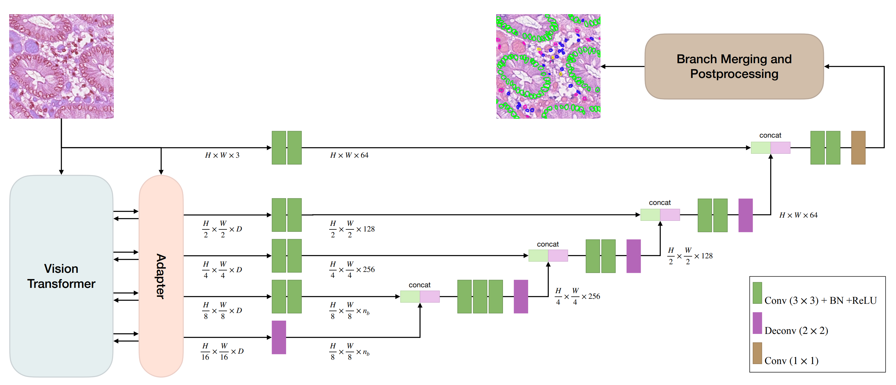

# CellVTA: Enhancing Vision Foundation Models for Accurate Cell Segmentation and Classification


This is the official implementation of CellVTA.

To reproduce the result in the paper, the processed data and model checkpoint can be downloaded at: [CellVTA-Google-Drive](https://drive.google.com/drive/folders/1yH1p9YCyQl6Es2O88P6a-Fc7qN0mx0Uk?usp=drive_link).

<!-- 

## Abstract

Cell instance segmentation is a fundamental task in digital pathology with broad clinical applications.  Recently, vision foundation models, which are predominantly based on Vision Transformers (ViTs), have achieved remarkable success in pathology image analysis. However, their improvements in cell instance segmentation remain limited. A key challenge arises from the tokenization process in ViTs, which aggressively reduces the spatial resolution of input images, leading to suboptimal segmentation quality, especially for small and densely packed cells. To address this problem, we propose CellVTA (Cell Vision Transformer with Adapter), a novel method that improves the performance of vision foundation models for cell instance segmentation by incorporating a CNN-based adapter module. This adapter extracts high-resolution spatial information from input images and injects it into the ViT through a cross-attention mechanism. Our method preserves the core architecture of ViT, ensuring seamless integration with pretrained foundation models. Extensive experiments show that CellVTA achieves 0.538 mPQ on the CoNIC dataset and 0.506 mPQ on the PanNuke dataset, which significantly outperforms the state-of-the-art cell segmentation methods. Ablation studies confirm the superiority of our approach over other fine-tuning strategies, including decoder-only fine-tuning and full fine-tuning. 

## Method
<p align="center">
  
</p>

 -->

## Overview
CellVTA is a novel method to perform cell segmentation and classification on pathology images. It comprises: (1) a ViT encoder, (2) an adapter module, and (3) a multi-branch decoder. First, the ViT encoder extracts features from an input image. Then the adapter module extracts multi-scale spatial information from the input image and injects them into the ViT encoder via feature interaction. The outputs of adapter are passed to the decoder via skip connections for cell segmentation. By incorporating a CNN-based adapter module, CellVTA improves the performance of vision foundation models for cell instance segmentation and outperforms the state-of-the-art methods on CoNIC dataset and PanNuke datasets.

<p align="center">
  
</p>


## Installation
1. Download this repository.
  <!-- `git clone https://github.com/TIO-IKIM/CellViT.git` -->

2. Create a conda environment with Python 3.9.7 version and install conda requirements: `conda env create -f environment.yml`. 

<!-- You can change the environment name by editing the `name` tag in the environment.yaml file. -->

3. Activate environment: `conda activate cellvta`

4. Install torch (these codes are tested under torch 2.0.0 with CUDA 11.8)
```bash    
pip install torch==2.0.0 torchvision==0.15.1 torchaudio==2.0.1 --index-url https://download.pytorch.org/whl/cu118
```

5. Install Deformable Attention

```bash  
cd models/ops
sh make.sh
```
If you meet any problem when installing Deformable Attention, please refer to the original repository: [Deformable-DETR](https://github.com/fundamentalvision/Deformable-DETR)


## Preparation
### Data
Download the preprocessed data from the `data` folder in  [CellVTA-Google-Drive](https://drive.google.com/drive/folders/1yH1p9YCyQl6Es2O88P6a-Fc7qN0mx0Uk?usp=drive_link). Put them in `./datasets` and `unzip` them.

### Pretrained Models
Pretrained CellVTA model checkpoints in the paper are publicly available. You can download them from the `checkpoints` folder in [CellVTA-Google-Drive](https://drive.google.com/drive/folders/1yH1p9YCyQl6Es2O88P6a-Fc7qN0mx0Uk?usp=drive_link) and put them in `./pretrained_models/cellvta`.

If you want to train CellVTA by yourself, you need to get the pretrained weights of UNI. You can access it from [UNI](https://huggingface.co/MahmoodLab/UNI) and put it in `./pretrained_models/vit_large_patch16_224.dinov2.uni_mass100k`.


### Configuration files
Examples configuration files are provided in the `configs` folder.

## Usage
### Train
```bash
python cell_segmentation/run_cellvit.py --config [config-file-path]
```

### Inference
```bash
python cell_segmentation/inference/inference_cellvit_experiment_pannuke_from_checkpoint.py --config [config-file-path] --output_dir [dictionary-to-save-results] --gpu 0  
```

To reproduce the results on pannuke with our checkpoint, run `inference_cellvit_experiment_pannuke_from_checkpoint.py` as below:
```bash
python cell_segmentation/inference/inference_cellvit_experiment_pannuke_from_checkpoint.py --config configs/inference/CellVTA_PanNuke_split1_inference.yaml --output_dir logs/inference --gpu 0
```


To reproduce the results on conic which needs upsamling inference, run `inference_cellvit_upscale.py` as below:
```bash
python cell_segmentation/inference/inference_cellvit_upscale.py --config configs/inference/CellVTA_Conic_upscale_inference.yaml --output_dir logs/inference --gpu 0
```


<!-- ## Citation

XXX
 -->
